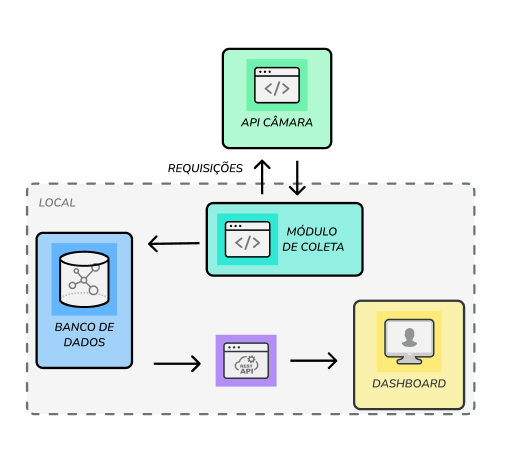
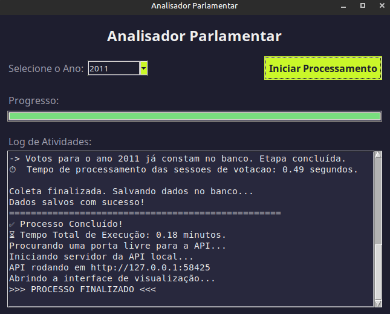
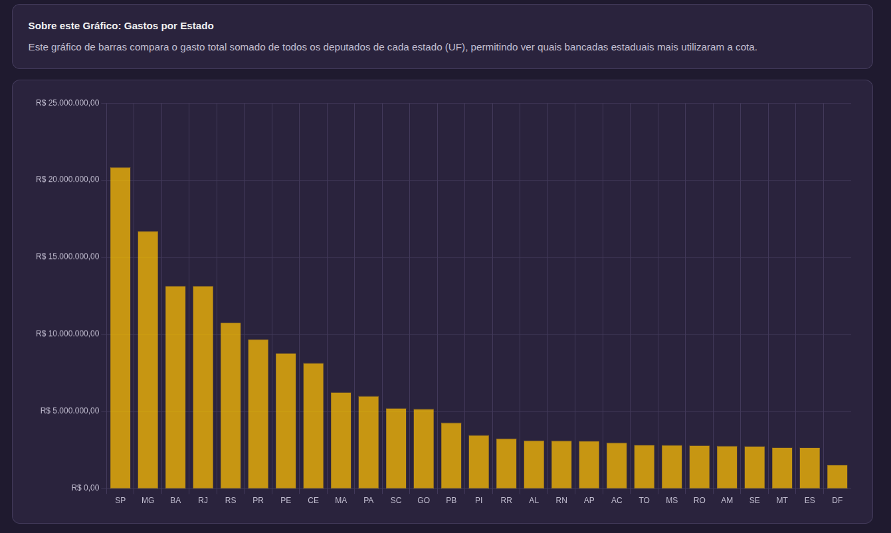
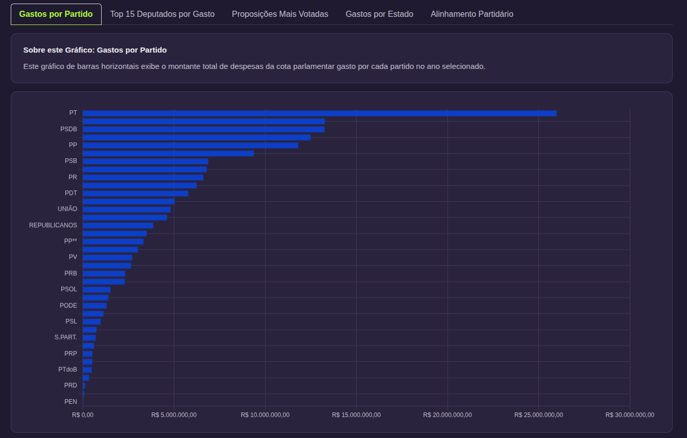

# 📊 FERRAMENTA INTEGRADA PARA EXTRAÇÃO E VISUALIZAÇÃO DE DADOS PARLAMENTARES

O portal da Câmara dos Deputados do Brasil oferece um volume massivo de informações sobre a atuação dos parlamentares. Contudo, a mera existência desses dados não garante a transparência. O "dilúvio de dados", sem as ferramentas adequadas para sua interpretação, pode ofuscar em vez de esclarecer.

Visando endereçar especificamente a barreira da complexidade técnica, este projeto apresenta uma prova de conceito (POC). A principal contribuição é o encapsulamento de todo o ciclo de vida dos dados, desde a coleta até o armazenamento em um banco de dados local.

Esta abordagem automatizada gera valor para dois públicos distintos:

1.  **Para o cidadão comum:** Reduz a barreira de entrada ao oferecer visualizações pré-definidas.
2.  **Para jornalistas e pesquisadores:** Simplifica a custosa etapa inicial de coleta e tratamento, entregando um banco de dados estruturado e pronto para ser consumido por ferramentas de análise mais robustas.

Este é um projeto híbrido que utiliza uma interface desktop (criada com Tkinter) para orquestrar o processamento de dados e o lançamento de um backend de API (FastAPI). O backend, por sua vez, serve os dados processados para um frontend de visualização (HTML/JS) que é aberto no navegador.

-----

## 📌 Índice

  * [Visão Geral e Funcionalidades](#-visão-geral-e-funcionalidades)
  * [O Desafio Principal](#-o-desafio-principal)
  * [Arquitetura e Estrutura de Dados](#-arquitetura-e-estrutura-de-dados)
  * [Galeria (Resultado Final)](#-galeria-resultado-final)
  * [Tecnologias Utilizadas](#-tecnologias-utilizadas)
  * [Pré-requisitos](#-pré-requisitos)
  * [Como Executar o Projeto](#-como-executar-o-projeto)

---

## 🗺️ Visão Geral e Funcionalidades

O ponto de partida é um painel de controle simples (GUI) que orquestra todo o processo de ETL e visualização.

### Funcionalidades

  * **Painel de Controle Desktop:** Uma interface simples para selecionar o ano e iniciar o processamento.
  * **Processamento de Dados (ETL):** Rotinas para baixar (se necessário), limpar, transformar e salvar os dados parlamentares.
  * **API Local:** Um servidor FastAPI é iniciado localmente em uma porta livre para servir os dados processados ao frontend.
  * **Visualização Web:** Uma interface web (frontend) que consome a API local e exibe os dados de forma interativa.

-----

## 🎯 O Desafio Principal

O núcleo da ferramenta é o módulo de coleta de dados. O principal desafio enfrentado foi a **extrema heterogeneidade dos dados** fornecidos pela Câmara. O processo é iniciado sob demanda para um ano específico e atua como um processo de ETL (Extract, Transform, Load) forçado a lidar com:

1.  **Formatos Múltiplos:** Os dados não estão em formato único. Dependendo do *endpoint*, as informações vêm em JSON, XML ou CSV.
2.  **Lógicas de Extração Distintas:** A obtenção de um conjunto completo de dados raramente é uma única chamada de API. Frequentemente, é preciso primeiro fazer uma requisição-mãe (ex: votações) e, em seguida, acessar *links* internos dessa resposta (ex: os votos individuais) para obter os detalhes.
3.  **Transformação e Unificação:** O módulo gasta esforço significativo limpando e padronizando esses dados de formatos e fontes distintas em um esquema único e coerente, antes de salvá-los no banco de dados.

---

## 🏗️ Arquitetura e Estrutura de Dados


### 1\. Arquitetura



### 2\. Schema do Banco de Dados

Após o ETL, os dados são salvos em um banco de dados SQLite local. 

>No entanto, como uma POC, a solução possui limitações claras que definem os trabalhos futuros. 
>A escolha do SQLite é um gargalo para a escalabilidade, sendo ideal sua substituição por um Data Warehouse em implementações futuras 
>que visem analisar maiores volumes de dados.


### 3\. Endpoints da API

A API local (FastAPI) serve os dados do banco SQLite para o frontend.


---

## 🖼️ Galeria (Resultado Final)

Após o processamento pela GUI, um dashboard é aberto no navegador, apresentando os dados de forma interativa.

> Esse dahsboard serve apenas como um exemplo de resultado final.
> As consultas úteis seriam mais robustas e a interface seria mais flexível.

#### 

#### 

#### 

---

## 💻 Tecnologias Utilizadas

  * **Painel de Controle:** Python + Tkinter
  * **Backend (API):** Python + FastAPI
  * **Frontend (Visualização):** HTML + CSS + JavaScript (Chart.js)
  * **Banco de Dados:** SQLite

---

## ⚙️ Pré-requisitos

Antes de começar, garanta que você tenha os seguintes softwares instalados:

1.  **[Python 3](https://www.python.org/downloads/)** (versão 3.9 ou superior)
2.  **[Git](https://www.google.com/search?q=https://git-scm.com/downloads)** (para clonar o repositório)

### 🐧 **Atenção Usuários de Linux\!**

Este projeto usa `Tkinter`, que **não** é instalado pelo `pip`. Você precisa instalá-lo manualmente pelo gerenciador de pacotes do seu sistema.

Para sistemas baseados em Debian/Ubuntu (como o Linux Mint), rode:

```bash
sudo apt install python3-tk
```

---

## 👨‍💻 Como Executar o Projeto

Foram criados scripts automáticos para facilitar a instalação e execução.

### 1\. Clone o Repositório

```bash
git clone https://github.com/Wexxxley/Ferramenta-para-extracao-e-visualizacao-de-dados-parlamentares.git
cd Ferramenta-para-extracao-e-visualizacao-de-dados-parlamentares
```

### 2\. Execute o Script de Instalação

Os scripts irão criar um ambiente virtual (`venv`), instalar todas as dependências do `requirements.txt` e, por fim, iniciar o painel de controle.

#### 🪟 No Windows:

1.  Encontre o arquivo `run.bat` na pasta.
2.  Dê dois cliques nele.
3.  O terminal será aberto, o processo de instalação começará e, ao final, a janela do painel de controle aparecerá.

#### 🐧 No Linux ou MacOS:

1.  Abra um terminal na pasta do projeto.
2.  Dê permissão de execução ao script (apenas na primeira vez):
    ```bash
    chmod +x run.sh
    ```
3.  Execute o script:
    ```bash
    ./run.sh
    ```
4.  O processo de instalação começará no terminal e, ao final, a janela do painel de controle aparecerá.

### 3\. Use a Aplicação

1.  Com o painel de controle (janela Tkinter) aberto, **selecione o ano** que deseja analisar.
2.  Clique em **"Iniciar Processamento"**.
3.  Acompanhe o progresso pela caixa de "Log de Atividades".

4.  Ao final, a aplicação irá **iniciar o servidor da API** e **abrir a interface de visualização** automaticamente no seu navegador padrão.
